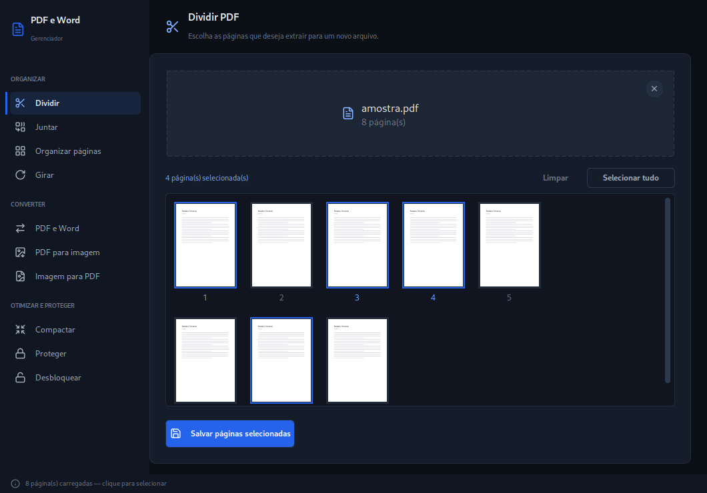
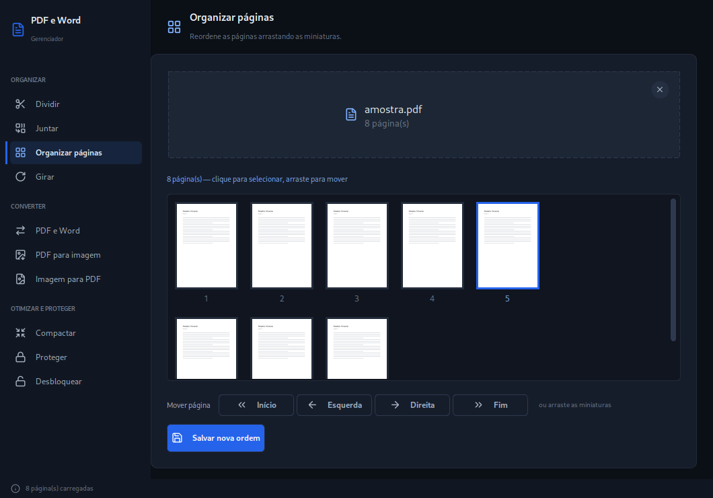

# Gerenciador de PDF e Word

Aplicação desktop em Python para trabalhar com PDF e Word: dividir, juntar,
organizar, girar, converter, compactar, proteger e desbloquear. Interface dark
em CustomTkinter, e nenhuma ferramenta toca no seu arquivo original.

Roda em Windows, macOS e Linux.



<details>
<summary>Mais telas</summary>

**Organizar páginas** — reordene arrastando as miniaturas ou pelos botões de mover.



**Juntar PDFs** — a ordem da lista é a ordem do resultado.


**Proteger com senha** — gera uma cópia cifrada com AES-256.


</details>

## Ferramentas

As dez ficam numa sidebar única, agrupadas por finalidade — nenhuma escondida
atrás de um clique extra.

**Organizar**

| Ferramenta | O que faz |
|---|---|
| **Dividir** | Mostra as páginas em miniatura; clique para escolher quais extrair |
| **Juntar** | Combina vários PDFs num só, na ordem que você definir |
| **Organizar páginas** | Reordena páginas arrastando as miniaturas ou pelos botões |
| **Girar** | Gira todas as páginas ou só as selecionadas, em 90°, −90° ou 180° |

**Converter**

| Ferramenta | O que faz |
|---|---|
| **PDF e Word** | PDF → `.docx` editável, ou `.docx` → PDF. O sentido é detectado sozinho |
| **PDF para imagem** | Exporta cada página como PNG ou JPG, a 72, 150 ou 300 DPI |
| **Imagem para PDF** | Junta imagens PNG/JPG num único PDF, reordenando como quiser |

**Otimizar e proteger**

| Ferramenta | O que faz |
|---|---|
| **Compactar** | Reduz o tamanho do arquivo em três níveis de compactação |
| **Proteger** | Gera uma cópia cifrada com AES-256, exigindo senha para abrir |
| **Desbloquear** | Gera uma cópia sem proteção, informando a senha atual |

## Seus arquivos estão seguros

Esta ferramenta escreve em documentos que você pode não ter em backup. Três
garantias valem para todas as ferramentas:

- **O arquivo de entrada nunca é sobrescrito.** Se o destino escolhido for uma
  das origens, a operação é recusada com aviso em vez de executada. A comparação
  é por caminho real, então caminho relativo e link simbólico também são pegos.
- **A gravação é atômica.** O PDF é escrito num arquivo temporário e só então
  assume o nome final: falha no meio do caminho não deixa um arquivo truncado
  que parece salvo.
- **Nada falha em silêncio.** Todo erro chega à tela com uma mensagem que diz o
  que fazer — inclusive o comando de instalação, quando falta um motor externo.

## Requisitos

- Python 3.10 ou superior

A conversão **Word → PDF** é a única que precisa de um motor externo:

| Sistema | Motor | Como obter |
|---------|-------|------------|
| Windows / macOS | Microsoft Word (via `docx2pdf`) | Já vem com o Office |
| Linux | LibreOffice headless | `sudo pacman -S libreoffice-fresh` ou `sudo apt install libreoffice-writer` |

As outras nove ferramentas não dependem disso e funcionam em qualquer sistema.

## Instalação

```bash
git clone https://github.com/mateusands/pdf-tool.git
cd pdf-tool

python -m venv .venv
source .venv/bin/activate     # Windows: .venv\Scripts\activate

pip install -r requirements.txt
```

## Como usar

```bash
python main.py
```

## Interface

- **Ícones vetoriais** ([Lucide](https://lucide.dev), ISC) rasterizados em tempo
  de execução no tamanho e na cor de cada estado. Nada de emoji: emoji muda de
  desenho conforme o sistema, tem cor fixa — não acompanha hover, foco nem
  estado desabilitado — e no Linux depende de uma fonte de emoji instalada.
- **Elevação tonal** — no escuro a profundidade vem da luminância da superfície,
  não de sombra: cinco níveis subindo ~6% cada, nenhum preto puro.
- **Contraste medido, não estimado.** Cada par de cor do tema é verificado pelo
  WCAG em teste (`pytest -k contraste`) e passa no AA (4,5:1). A regra que isso
  protege: não existe letra mais branca que branco — quando falta contraste num
  botão, quem escurece é o preenchimento.
- **Tipografia nativa** — a família é escolhida entre as instaladas no sistema
  (Segoe UI, SF Pro, Inter/Cantarell/Noto), em vez de cair num fallback sorteado.
- **A janela não congela.** Todo trabalho pesado roda fora da thread da interface.

## Testes

A lógica de arquivo vive fora da interface, em `pdf_tool/core/`, que não importa
Tkinter. Por isso a suíte roda sem abrir janela e sem display:

```bash
pip install -r requirements.txt -r requirements-dev.txt
pytest                       # suíte completa
pytest -k destino            # um recorte
```

Cada arquivo de teste começa pela especificação do contrato que ele cobre: o que
a função promete, **por que existe** — em geral o bug que a originou — e qual
regra de negócio está sendo protegida.

## Estrutura do projeto

```
pdf-tool/
├── main.py                      ← EXECUTÁVEL: python main.py
│
├── pdf_tool/                    # o aplicativo
│   ├── app.py                   # janela, sidebar, cabeçalho de contexto, status bar
│   ├── theme.py                 # única fonte de cor, fonte e espaçamento
│   ├── widgets.py               # botão, pills, campo de senha, drop zone, miniaturas
│   │
│   ├── core/                    # lógica pura, sem UI — é o que os testes cobrem
│   │   ├── pdf_io.py            # toda escrita de PDF: destino ≠ origem, gravação atômica
│   │   ├── docx_convert.py      # Word → PDF: Word no Windows/macOS, LibreOffice no Linux
│   │   ├── background.py        # trabalho pesado em thread + retorno seguro para a UI
│   │   ├── icons.py             # catálogo Lucide, rasterização SVG, ícone da janela
│   │   ├── fonts.py             # escolha da família de fonte por plataforma
│   │   ├── contrast.py          # razão de contraste WCAG
│   │   └── reorder.py           # reordenação de listas (páginas e arquivos)
│   │
│   └── tabs/                    # uma classe por ferramenta
│       ├── tab_split.py         # Dividir
│       ├── tab_merge.py         # Juntar
│       ├── tab_organize.py      # Organizar páginas
│       ├── tab_rotate.py        # Girar
│       ├── tab_convert.py       # PDF e Word
│       ├── tab_pdf_to_image.py  # PDF para imagem
│       ├── tab_image_to_pdf.py  # Imagem para PDF
│       ├── tab_compress.py      # Compactar
│       ├── tab_protect.py       # Proteger
│       └── tab_unlock.py        # Desbloquear
│
├── tests/                       # suíte da lógica pura — roda sem abrir janela
│   ├── test_pdf_io.py           # integridade do arquivo, senha, operações
│   ├── test_docx_convert.py     # escolha de motor por plataforma
│   ├── test_background.py       # erro em thread chega mesmo à tela
│   ├── test_icons.py            # render, ícone da janela, varredura de emoji
│   ├── test_contrast.py         # cada par de cor do tema contra o AA
│   ├── test_fonts.py            # escolha da família por plataforma
│   ├── test_reorder.py          # mover e arrastar
│   └── test_scroll.py           # roda do mouse por plataforma
│
├── requirements.txt             # dependências para rodar o app
├── requirements-dev.txt         # + pytest (desenvolvimento)
└── pytest.ini
```

A separação que importa: **`pdf_tool/core/` não conhece Tkinter.** É essa regra
que mantém a lógica testável e a interface substituível.

## Dependências

| Pacote | Uso |
|--------|-----|
| `customtkinter` | Widgets dark mode sobre o Tkinter |
| `pypdf` | Leitura, escrita, divisão, rotação e criptografia de PDFs |
| `pymupdf` | Miniaturas, compactação, PDF ↔ imagem e rasterização dos ícones |
| `pdf2docx` | Conversão de PDF para Word |
| `docx2pdf` | Word para PDF no Windows/macOS (no Linux o motor é o LibreOffice) |
| `cryptography` | PDFs cifrados com AES |

Os ícones vêm do conjunto [Lucide](https://lucide.dev) v1.27.0, sob licença ISC.
Os desenhos ficam embutidos em `pdf_tool/core/icons.py` como caminhos SVG e são
rasterizados pelo `pymupdf` — **não há pacote nem fonte a instalar por causa
deles**.
